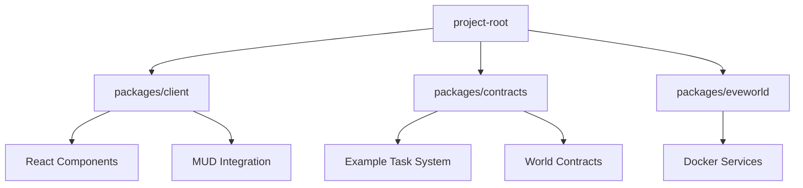
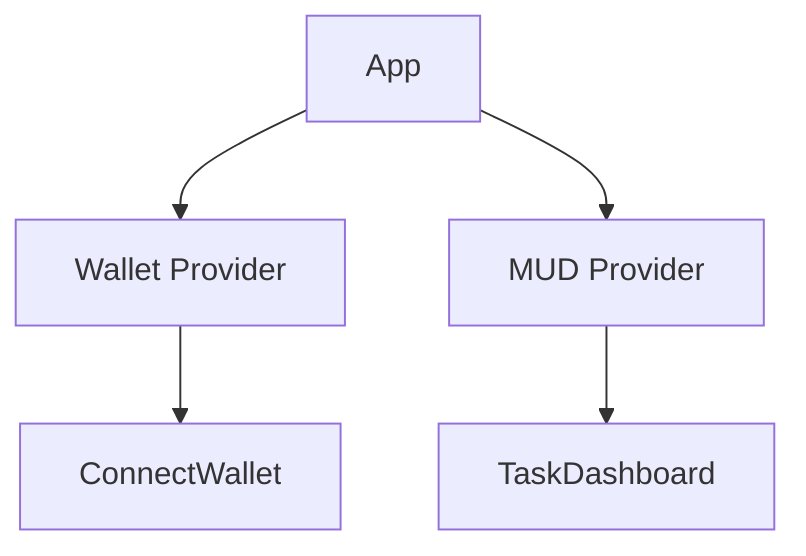
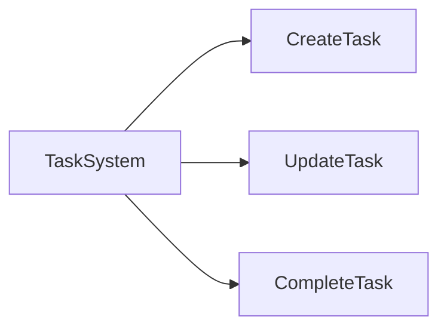

# Tribe MUD DApp Scaffold

A modular foundation for building MUD-based decentralized applications with React frontend and Solidity smart contracts.

## Technology Stack

- **Frontend**: React + TypeScript + Vite + TailwindCSS
- **Smart Contracts**: Solidity + Foundry + MUD
- **Tooling**: pnpm workspaces, mprocs, ESLint, Prettier

## Project Structure



### Key Directories

| Package       | Purpose                          | Key Features                     |
|---------------|----------------------------------|----------------------------------|
| `/client`     | Frontend application             | - Wallet integration<br>- MUD context providers<br>- Task dashboard UI |
| `/contracts`  | Smart contract system            | - Task management system<br>- MUD world architecture<br>- Foundry testing |
| `/eveworld`   | Local development environment    | - Docker-compose setup<br>- Service configuration |

## Getting Started

### Prerequisites
- Node.js v18+
- pnpm
- Foundry
- Docker

### Installation
```bash
pnpm install
```

### Development Workflows

#### Getting Started Commands
```bash
# Starts an eveworld v2 on a local node @ http://localhost:8586
pnpm world:up 

# Initiate an mprocs that,
# - Forks the world node above into http://localhost:8584
# - Deploys the systems defined in the `contracts` package in watch mode.
# - Start the client @ http://localhost:3000 in watch mode
# - Runs system tests defined in `contracts` (requires the contract deployement to resolve first). Process will fail initially but after contract deployement, press "R", to rerun them.
pnpm dev
```

## System Architecture

### Frontend Structure


### Contract Structure


## Contributing

1. Create feature branch
2. Add tests for changes
3. Submit PR with:
   - Description of changes
   - Screenshots (if UI)
   - Test instructions

## License

[MIT](/LICENSE)
