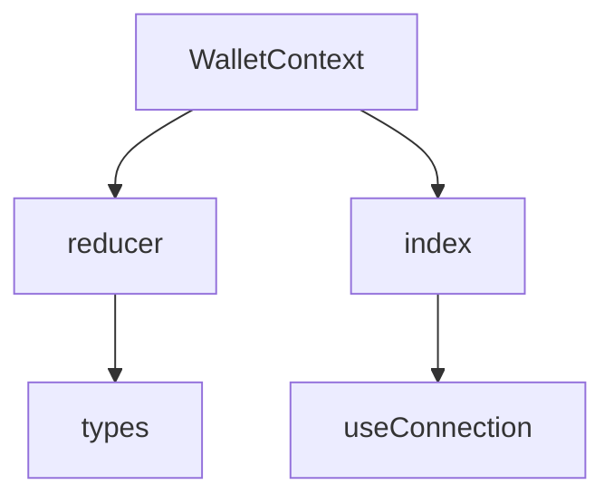

# Wallet Provider

A comprehensive wallet management system for blockchain interactions, supporting multiple wallets and networks.

## Overview

The wallet provider manages wallet connections, network configurations, and provider interactions. It uses the EIP6963 standard for wallet detection and provides a context-based API for seamless integration across components.

## Features

- **Wallet Connection Management**: Handles connection and disconnection of wallets.
- **Network Configuration**: Manages network settings and chain configurations.
- **Provider Discovery**: Detects and integrates EIP6963-compliant wallet providers.
- **State Management**: Uses a reducer pattern for consistent state handling.
- **Multi-Wallet Support**: Supports multiple wallet types through a unified interface.

## Architecture

The wallet provider consists of several key components:



### Key Components

1. **WalletContext**: Manages the wallet state and provides context to child components.
2. **reducer**: Handles state changes for wallet connections and network configurations.
3. **types**: Defines interfaces and types for consistent data handling.
4. **index**: Exports the main components and hooks for application use.

## Usage

### Installation

Ensure the wallet provider is part of your project dependencies. If using a monorepo, it's already available in `packages/client/src/providers/wallet`.

### Setup

1. Import the necessary components:

```tsx
import { WalletProvider, useConnection } from '@eveworld/contexts';
```

2. Wrap your application with `WalletProvider`:

```tsx
function App() {
  return (
    <WalletProvider>
      <YourApp />
    </WalletProvider>
  );
}
```

3. Use the `useConnection` hook in components:

```tsx
const { handleConnect, handleDisconnect, connectedProvider } = useConnection();
```

### Example Usage

```tsx
const MyComponent = () => {
  const { handleConnect, connectedProvider } = useConnection();

  return (
    <button 
      onClick={connectedProvider.connected ? handleDisconnect : handleConnect}
    >
      {connectedProvider.connected ? 'Disconnect' : 'Connect Wallet'}
    </button>
  );
};
```

## State Management

### Initial State

```typescript
interface Connection {
  connectedProvider: {
    provider: EIP1193Provider | null;
    connected: boolean;
  };
  gatewayConfig: GatewayNetworkConfig;
  publicClient: PublicClient | null;
  walletClient: WalletClient | null;
  bundlerClient: BundlerClient | null;
  availableWallets: string[];
  defaultNetwork: Omit<ChainConfig, "systemIds">;
}
```

### Action Types

```typescript
enum ActionTypes {
  CONNECT = "CONNECT",
  DISCONNECT = "DISCONNECT"
}
```

### State Transitions

- **CONNECT**: Handles successful wallet connection, setting the provider and network configuration.
- **DISCONNECT**: Clears wallet and network connections.

## Dependencies

- **EIP1193Provider**: For wallet detection and interaction.
- **Viem**: For blockchain client operations.
- **Supported Chains**: Defined in `packages/client/src/data/mud/network/supportedChains.ts`.

## Environment Variables

- `VITE_CHAIN_ID`: Specifies the default network chain ID.
- `VITE_GATEWAY_HTTP`: Blockchain gateway HTTP endpoint.
- `VITE_GATEWAY_WS`: Blockchain gateway WebSocket endpoint.

## Contributing

- Fork the repository.
- Create a feature branch.
- Commit changes with clear commit messages.
- Push to the branch and create a Pull Request.

## License

[Your License Here]
